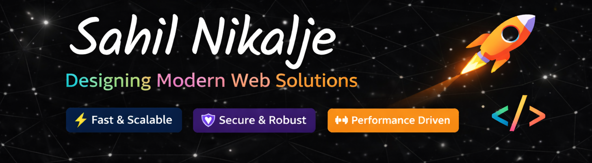

<div align="center">

  

  <br/><br/>

  <a href="https://git.io/typing-svg">
    
  </a>

  <br/><br/>

  <p>
    <a href="https://portfoliosahilnikalje.netlify.app/" target="_blank">
      
    </a>
    <a href="mailto:sahilnik88@gmail.com">
      
    </a>
    <a href="https://www.linkedin.com/in/sahil-nikalje-9b618a225/" target="_blank">
      
    </a>
    <a href="https://instagram.com/sahilnik88" target="_blank">
      
    </a>
    <a href="https://www.leetcode.com/sahilnik88" target="_blank">
      
    </a>
  </p>

  

</div>

<br/>

---

## 🧑‍💻 About Me

```javascript
const sahil = {
  title      : "MERN Stack Developer 🚀",
  education  : "MERN Stack Web Dev @ Masai School ✅",
  techStack  : ["MongoDB", "Express.js", "React", "Node.js", "Next.js", "TypeScript"],
  askMeAbout : ["MERN Stack", "Next.js", "TypeScript", "REST APIs"],
  currentFocus: "Building scalable full-stack web applications",
  funFact    : "I debug with console.log and I'm proud of it 😄",
  openTo     : "Exciting opportunities & collaborations 🤝"
};
```

<br/>

---

## 🛠️ Tech Stack

#### 💻 Languages & Frameworks

<p align="center">
  
  
  
  
  <br/>
  
  
  
  
  
  
  
</p>

#### ⚙️ Tools & Platforms

<p align="center">
  
  
  
  
  
  
  
</p>

<br/>

---

## 🔥 What I Build

<div align="center">

| 🌐 Frontend | ⚙️ Backend | 🗄️ Database |
|:---|:---|:---|
| ⚛️ React & Next.js apps | 🟢 RESTful APIs with Node + Express | 🍃 MongoDB with Mongoose |
| 🎨 Responsive UIs with Tailwind | 🔐 Authentication & Authorization | 📐 Schema design & queries |
| 🔷 TypeScript components | 🛡️ Middleware & error handling | ⚡ Optimized CRUD operations |

</div>

<br/>

---

<div align="center">

### 💬 *"First, solve the problem. Then, write the code."*

<br/>

<a href="https://portfoliosahilnikalje.netlify.app/" target="_blank">
  
</a>
&nbsp;
<a href="mailto:sahilnik88@gmail.com">
  
</a>

<br/><br/>

*Let's connect and build something amazing together!* ✨

</div>
